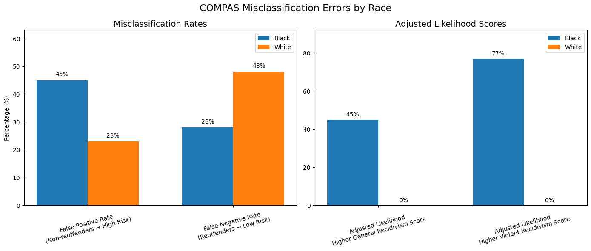

### Auditing Algorithmic Bias in Criminal Justice

**Objective:** Quantify systemic racial disparities in predictive policing and criminal risk assessment algorithms.

**The Signal**
* **Engineered** a quantitative audit of the ProPublica COMPAS Recidivism dataset utilizing Python (Pandas/NumPy) to evaluate algorithmic neutrality in judicial decision-making.
* **Identified** a critical 22% racial disparity in automated risk classification, proving that the algorithm yields a 45% False Positive Rate for Black defendants compared to a 23% False Positive Rate for White defendants.
* **Published** findings on automated governance to demonstrate how baseline code logic inadvertently reinforces socio-legal inequalities, advocating for algorithmic transparency in public sector tech deployment.

**The Evidence: False Positive vs. False Negative Rates**

*Methodology: Comparative statistical analysis and data visualization using Matplotlib.*
