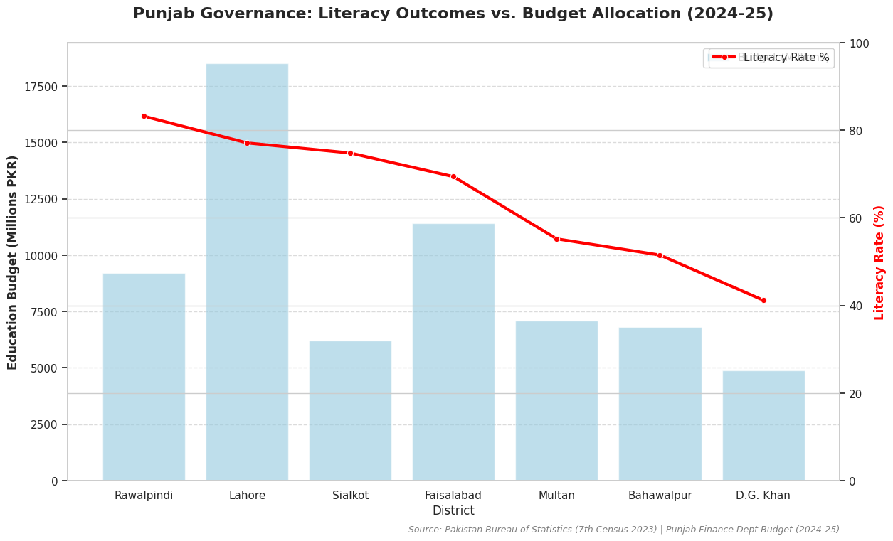

### Optimizing Governance: Punjab Education Budget Efficiency Model

**Objective:** Evaluate whether education spending correlates with literacy outcomes to assess provincial governance efficiency.

**The Signal**

* **Engineered** a "Cost-per-Literacy-Point" metric using 2023 Census data and Python to evaluate provincial budget efficiency.
* **Developed** dual-axis visualizations in Seaborn identifying that high-budget urban allocations (e.g., Lahore) do not consistently correlate with literacy gains.
* **Identified** that Rawalpindi achieves higher literacy outcomes with a smaller education budget compared to Lahore, proving that governance efficiency and implementation quality matter more than budget size alone.

**The Evidence: Literacy Outcomes vs. Budget Allocation**

*Data Source: Pakistan Bureau of Statistics (7th Census 2023), Punjab Finance Department (2024-25 Budget). Methods: Data visualization using Python (Pandas/Seaborn).*
